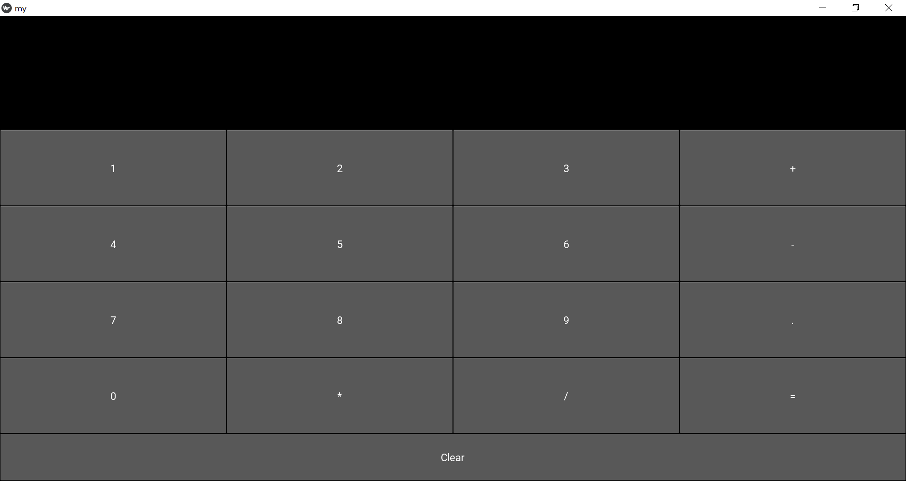

Kivy Calculator GUI App
A simple calculator application built using Python and the Kivy framework. This GUI-based calculator supports basic arithmetic operations and demonstrates how to build cross-platform desktop apps using Kivy without a .kv design file.

Demo

Features
Clean and responsive GUI using Kivy

Supports basic arithmetic operations: +, -, *, /

Clear button to reset the input

Evaluates mathematical expressions using Python’s eval()

Built entirely in Python (no external .kv file)

Tech Stack
Language: Python 3.x

GUI Framework: Kivy

Project Structure
kivy-calculator/
├── calculator.py      # Main Python file with GUI logic

├── README.md          # Project documentation

└── assets/
    └── calculator.png # Screenshot of the calculator GUI
